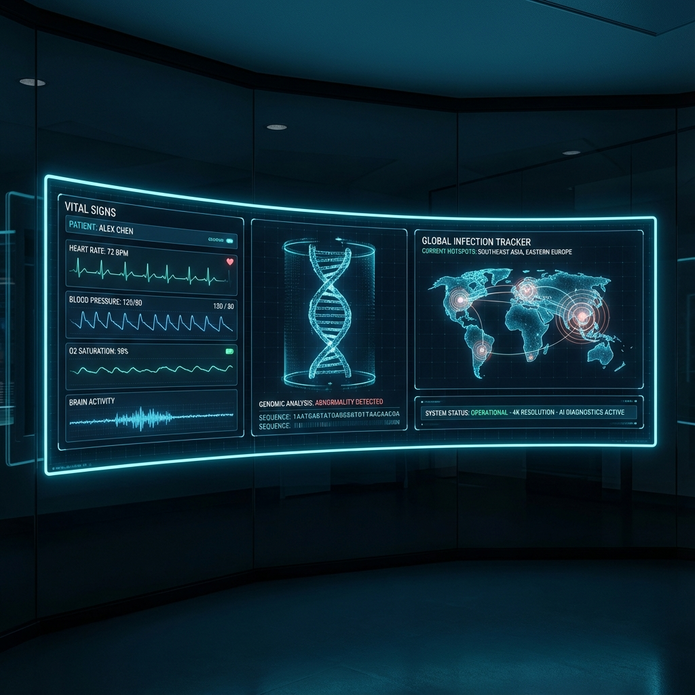

<div align="center">
  

  # 🏥 MedWatch
  ### Advanced Hospital MDR Management System

  <p align="center">
    
    
    
    
  </p>

  <p align="center">
    <strong>MedWatch</strong> is an enterprise-grade solution designed to combat Multi-Drug Resistant (MDR) infections in hospital environments. 
    It combines real-time IoT tracking, automated lab report analysis, and intelligent alert systems to ensure patient safety and streamline infection control.
  </p>

  [Quick Start](#-quick-start) • [Features](#-core-capabilities) • [Architecture](#-system-architecture) • [API](#-api-overview) • [Support](#-support)

</div>

---

## 🚀 Quick Start

Get your hospital up and running in **under 5 minutes**.

### Prerequisites
- **Node.js** v16+
- **npm** or **yarn**

### 1️⃣ Installation

```bash
# Clone the repository (if applicable)
git clone <repo_url>

# Install Backend Dependencies
cd server
npm install

# Install Frontend Dependencies
cd ../client
npm install
```

### 2️⃣ Launch System

**Backend Server (Port 5000)**
```bash
cd server
npm start
# Output: Server + Socket listening on 5000 🚀
```

**Frontend Dashboard (Port 4000)**
```bash
cd client
npm run dev
# Open http://localhost:4000
```

### 3️⃣ Access Portals

| Portal | Credentials (Email / Pass) | Usage |
| :--- | :--- | :--- |
| **Admin Dashboard** | `admin@hospital.com` / `admin123` | System config, user management, full oversight |
| **Doctor Portal** | `doctor@hospital.com` / `doctor123` | Patient tracking, reviewing alerts, lab reports |

---

## 💎 Core Capabilities

### 🛡️ Infection Control & MDR Detection
*   **Automated Analysis**: Instantly scans lab reports for **MRSA, ESBL, VRE, CRE**, and other critical pathogens.
*   **Dual-Engine Detection**: Identifies MDR based on known organism lists AND resistance profile analysis (≥3 antibiotic classes).
*   **Real-time Alerts**: Critical notifications sent to Infection Control Teams immediately via **Socket.io**.

### 📍 Interactive Patient Tracking
*   **Live Map**: Visual representation of patient locations and contamination zones.
*   **Contact Tracing**: Graph-based visualization of patient-staff-visitor interactions to predict infection vectors.
*   **Zone Management**: Define high-risk areas and monitor movement flow.

### 📝 Lab & Data Management
*   **Universal Upload**: Drag-and-drop support for **JSON** and **CSV** lab reports.
*   **Batch Processing**: Handle hundreds of reports simultaneously with duplicate detection.
*   **Smart Validation**: Automatic error checking and data sanitization before ingestion.

---

## 🏗️ System Architecture

MedWatch is built on a robust, scalable architecture designed for reliability.

```mermaid
graph TD
    Client[Process: Client (React + Vite)]
    Server[Process: Server (Node + Express)]
    DB[(Database: SQLite/Postgres)]
    Socket[WebSocket Service]
    MDR[MDR Analysis Engine]
    
    Client -->|REST API| Server
    Client -- Real-time --> Socket
    Server --> DB
    Server -->|Events| Socket
    Server -->|Lab Data| MDR
    MDR -->|Alerts| Socket
```

### 🛠️ Technology Stack

| Logic & API | Interface | Data & Real-time |
| :--- | :--- | :--- |
|  **Node.js** |  **React 18** |  **SQLite** |
|  **Express** |  **Tailwind** |  **Socket.io** |
|  **Security** |  **Vite** |  **ORM** |

---

## 🔌 API Overview

Full documentation available in [`API_REFERENCE.md`](./API_REFERENCE.md).

### 🔑 Authentication
*   `POST /api/auth/login` - Secure user login
*   `POST /api/auth/register` - Staff registration

### 🧬 Lab Reports
*   `POST /api/labreports/upload` - Single report ingestion
*   `POST /api/labreports/upload-file` - Batch CSV/JSON processing
*   `GET /api/labreports/mdr/flagged` - Retrieve critical MDR cases

### 🔔 Notifications
*   `GET /api/notifications/unread` - Fetch active alerts
*   `PUT /api/notifications/:id/read` - Acknowledge alert

---

## 📂 Project Structure

```bash
Med-2/
├── client/                 # ⚛️ React Frontend
│   └── src/pages/          # Application Views
├── server/                 # 🖥️ Express Backend
│   ├── src/models/         # Database Schemas
│   └── src/services/       # Business Logic (MDR, Uploads)
├── assets/                 # 🎨 Project Assets
├── API_REFERENCE.md        # 📘 API Docs
└── README.md               # 📖 You are here
```

---

## 🤝 Support

Need help? Check out our detailed guides:

*   **[Frontend Guide](./client/README.md)**: UI features and setup.
*   **[Lab Integration](./LAB_REPORT_IMPLEMENTATION.md)**: Deep dive into lab report logic.
*   **[File Uploads](./FILE_UPLOAD_GUIDE.md)**: How to format your data.

> **Troubleshooting Tip**: If you don't see alerts, ensure your browser isn't blocking the WebSocket connection to `localhost:5000`.

---

<div align="center">
  <small>Designed for the Smart India Hackathon. &copy; 2025 MedWatch.</small>
</div>
